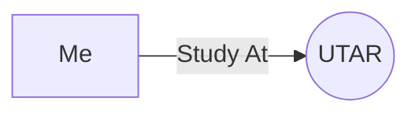

### This is the design that I have editted after retrieving from the owner repository. Click [here](https://github.com/Ayushparikh-code/creative-profile-readme) to visit owner repo, Thank you.
### https-github.com-Ayushparikh-code-creative-profile-readme
# My Profile :stuck_out_tongue:
### Name: *Fong Y-Hoe* :boy:
### ID: *1900228*
### Course: *Software Engineering*
### Year/Trimester: *Y3/S2*

[This is the link to e-WBLE](https://ewble-sl.utar.edu.my/login/index.php) 

[and this is the link to UTAR Portal](https://ewble-sl.utar.edu.my/login/index.php)

# Programming Language that I have learned::+1:

### Sample Mathematical Formula:
$$
\Gamma(z) = \int_0^\infty t^{z-1}e^{-t}dt\,.
$$ 

### Sample Flowchart

